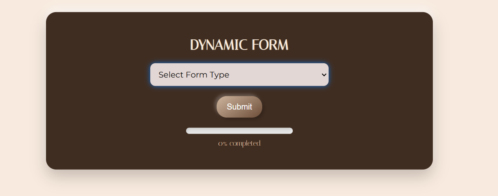

# **DynamicForm - React.js**

Welcome to the **DynamicForm**, a user-friendly and feature-rich React application designed to handle multiple dynamic form types with ease and flexibility. This project demonstrates the seamless integration of React concepts, state management, and modern web design principles.

---

## **Features**

### 1. **Dynamic Form Generation**

- Automatically generates forms based on pre-defined configurations, showcasing modularity and reuse of code.
- Supports three form types:
  - **User Information**: Collects personal details like First Name, Last Name, and Age.
  - **Address Information**: Captures address details, including dropdown options for state selection.
  - **Payment Information**: Secures sensitive payment data with fields like Card Number, Expiry Date, and CVV.

### 2. **Real-Time Input Handling**
- Real-time state updates ensure the form reacts to user inputs immediately.
- Includes validation for required fields, ensuring data integrity and accurate submissions.

### 3. **Progress Indicator**
- A visually appealing **progress bar** tracks the completion percentage of the form in real-time, encouraging users to complete all fields.

### 4. **Data Submission and Visualization**
- Captures submitted form data and displays it in a structured, readable format using a responsive **data table**.
- Useful for visualizing all user submissions without needing external tools.

### 5. **Modular and Scalable Code Structure**
- The use of **API-driven configurations** (e.g., `apiResponses`) makes it easy to add or modify form types with minimal changes.
- Implements a clean and maintainable component-based architecture.

### 6. **Enhanced User Experience**
- Provides intuitive form inputs, including:
  - **Text Fields**
  - **Select Dropdowns**
  - **Checkboxes**
- Incorporates thoughtful UX elements like tooltips, labels, and placeholders to guide users through the form.

---

## **Technical Highlights**
- **React State Management**: Efficient use of `useState` to manage dynamic forms and form data.
- **Responsive Design**: A clean and minimal UI implemented through CSS, ensuring compatibility across devices.
- **Code Modularity**: Clear separation of concerns with functions for handling input, submission, and rendering.

---

## **Why this Project Stands Out**
This project is more than just a form builder; it's a demonstration of problem-solving, adaptability, and attention to user experience. It highlights my ability to:
- Translate requirements into functional components.
- Handle complex interactions with simplicity.
- Write maintainable and scalable code for real-world applications.

---

I hope this DynamicForm resonates with the mission of your team and showcases my capability to contribute meaningfully to your internship program. Thank you for reviewing!
